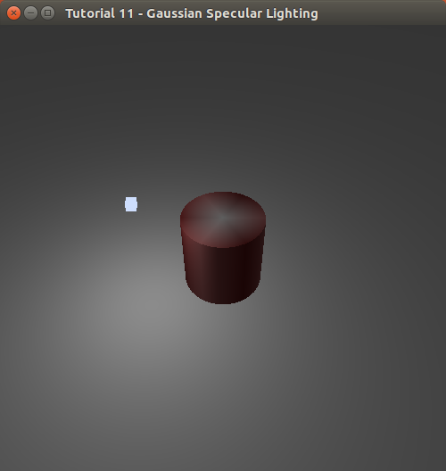

Note: at the moment there is ~~a gradle,~~ a general refreshing and kotlin implementation in progress, it'll be back to normal asap (the most tedious work is to complete chapter 12, it's quite long actually)

modern-jogl-examples
====================

 

Examples ported in JOGL from the tutorials "Learning Modern 3D Graphic Programming" by J.L.McKesson, (original bitbucket [repository](https://bitbucket.org/alfonse/gltut/overview)).

The original website (http://www.arcsynthesis.org/gltut) is down because probably the domain [expired](https://bitbucket.org/alfonse/gltut/issues/127/arcsynthesisorg-web-site). Pavel Rojtberg is continuing the manteinance of the tutorial [here](https://github.com/paroj/gltut). 

He is also supporting the html form of the documentation [here](https://paroj.github.io/gltut/), I strongly suggest you to read and refer it during the learning of each tutorial sample.

You can find the examples in java under [`src/main/java`](https://github.com/java-opengl-labs/modern-jogl-examples/tree/master/src/main/java/main) and the corresponding in kotlin under [`src/main/kotlin`](https://github.com/java-opengl-labs/modern-jogl-examples/tree/master/src/main/kotlin/main)

Status:

- [x] Chapter 1, Hello Triangle
- [x] Chapter 2, Playing with Colors
- [x] Chapter 3, Moving Triangle
- [x] Chapter 4, Objects at Rest
- [x] Chapter 5, Objects at Depth
- [x] Chapter 6, Objects in Motion
- [x] Chapter 7, World in Motion
- [x] Chapter 8, Getting Oriented
- [x] Chapter 9, Lights On
- [x] Chapter 10, Plane Lights
- [x] Chapter 11, Shinies
- [ ] Chapter 12, Dynamic Lights
- [x] Chapter 13, Lies and Impostors
- [x] Chapter 14, Textures are not Pictures
- [ ] Chapter 15, Many Images
- [ ] Chapter 16, Gamma and Textures
- [ ] Chapter 17, Spotlight on Textures
